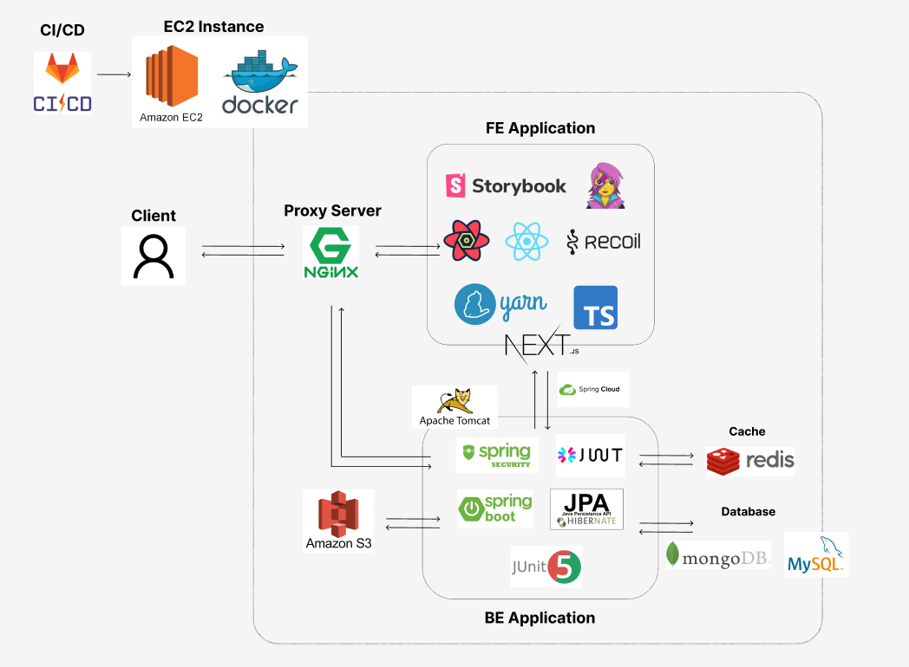

# 너구리 - '너'의 '구'역에 취미거'리'

## :date: 프로젝트 진행 기간
2022.10.10 ~ 2022.11.18

## ✔ 서비스 소개
_- 지역 기반 취미모임 커뮤니티 -_

## ✔ 팀원 소개
| 최창효                                                                                                  | 전한울                                                                                                  | 박상태                                                                                                   | 신은정                                                                                                  | 안호진                                                                                                | 이승호                                                                                                   |
|:----------------------------------------------------------------------------------------------------:|:----------------------------------------------------------------------------------------------------:|:-----------------------------------------------------------------------------------------------------:|:----------------------------------------------------------------------------------------------------:|:--------------------------------------------------------------------------------------------------:|:-----------------------------------------------------------------------------------------------------:|
|  |  |  |  |  |  |

## ✔ 사용 기술
Frontend
- Next.js, Recoil, React-Query

Backend
- SpringBoot, JPA, SpringCloud

Database
- MySQL, MongoDB, Redis, Kafka

Infra
- Docker, EC2, Gitlab-CI, S3, Nginx

## ✔ 아키텍처

## ✔ 기능 소개

**회원가입**

- 이름, 나이, 내 구역(지역) 등의 정보를 입력하고 회원가입을 할 수 있습니다.

**로그인** 

- 이메일과 비밀번호를 입력하여 로그인합니다.

**취미모임 등록**

- 등록할 취미의 카테고리를 선택합니다.
- 모임방 대표 이미지와 내용(제목, 상세내용, 모집인원, 모임 날짜, 모임 장소, 참가회비)를 입력합니다.
- 모임방에 참여할 수 있는 나이와 성별을 제한할 수 있습니다.

**중고거래 등록**

- 등록할 중고거래의 카테고리를 선택합니다.
- 거래할 물품의 사진과 내용(제목, 상세내용, 가격)을 입력합니다.

**메인 페이지**

- 회원가입 시 설정한 내 구역의 취미모임, 중고거래 리스트를 볼 수 있습니다.
- 취미모임 더보기, 중고거래 더보기를 클릭하여 모든 리스트를 볼 수 있습니다.
- 취미모임방, 중고거래방 클릭 시 상세보기가 가능합니다.

**지역**

- 새로운 지역을 설정할 수 있습니다.
- 왼쪽 상단의 지역버튼을 클릭하여 새로운 동네 이름(동, 읍, 면)을 검색합니다.
- 조회된 동네를 선택하면 해당 지역으로 내 구역 설정이 변경됩니다.

**취미모임 상세화면**

- 취미모임방의 안내사항(현재인원/모집인원, 참가회비, 모임 날짜, 모임 장소, 제한사항)을 확인할 수 있습니다.
- 즐겨찾기 등록/해제할 수 있습니다.
- 참여 신청하기 버튼을 클릭하여 모임방 호스트에게 참여 신청 알람을 보낼 수 있습니다.

**중고거래 상세화면**

- 중고거래 내용(물품 사진, 설명, 가격)을 확인할 수 있습니다.
- 즐겨찾기 등록/해제할 수 있습니다.
- 채팅하기 버튼을 클릭하여 판매자와 소통할 수 있습니다.

**마이 페이지**

- 취미거리
    - 본인이 참여중인 취미방, 운영중인 취미방,  찜해놓은 취미방, 참여신청 후 대기중인 취미방리스트를 각각 모아볼 수 있습니다
- 중고거래
    - 본인이 판매한 물품, 판매완료한 물품, 구매완료한 물품, 찜해놓은 물품 리스트를 각각 모아볼 수 있습니다.
- 프로필 수정
    - 연필 버튼을 누르면 프로필 사진, 닉네임을 수정할 수 있습니다.

**채팅**

- 중고거래 채팅(1대1 채팅): 중고거래를 원하는 구매자는 판매자에게 채팅을 통해 가격, 장소등을 문의할 수 있습니다.
- 취미 모임 채팅(그룹 채팅): 취미모임 참여자들은 취미 모임 채팅방을 통해 취미에 관하여 채팅할 수 있습니다.

**알림**

- 취미 알람
    - 취미 모임 방장: 취미 모임 참여자가 취미 모임 신청 시 취미 모임 방장에게 알람이 갑니다.
    - 취미 모임 참여자: 취미 모임 방장이 참여자를 승인/거절 시 취미 모임 참여자에게 알람이 갑니다.
- 채팅 알람
    - 내가 속해있는 채팅방에서 채팅 발생 시 나에게 알림이 옵니다.

## ✔ 핵심 기능
